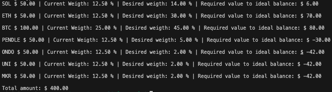

# Investcli

This CLI provides an easy way for you to take a peek on your investments in Coinbase and Crypto.com.

The only supported feature for now grabs all of your crypto tokens from those two exchanges, convert them to Canadian Dollars, and returns their weights in relation to the total wallet balance.



## Set up

### Clone the repository

```
git clone git@github.com:vrochamaia/invest-cli.git
```

### Configure the secrets file

Go to the root of the repository and create a `secrets.json` file with your Coinbase and/or Crypto.com keys. **Never commit this file to a remote branch** since anyone with access to it can at least read your crypto positions on those exchanges.

```
secrets.json

{
    "coinbase": {
        "key": "your public key"
        "privateKey": "your private key"
    },
    "cryptoDotCom": {
        "key": "your public key"
        "privateKey": "your private key"
    }
}
```

If you don't use one of the those exchanges you can just omit the respective object.

You can find more details on how to generate those keys from the Coinbase and Crypto.com API docs.

- [Coinbase](https://docs.cdp.coinbase.com/coinbase-app/docs/quickstart)
- [Crypto.com](https://exchange-docs.crypto.com/exchange/v1/rest-ws/index.html?javascript#generating-the-api-key)

### Configure the desired wallet file (optional)

If you want to compare the current weight of each token of your wallet against what you expect their weights to be, you can fill out the `desired-wallet.json` file with the expected weight of each token.

```
{
    "BTC": 50,
    "ETH": 30,
    "SOL": 20
}
```

The key is the crypto token. The value is the expected percentage of the total wallet.

## CLI Command

The only comand available is the `balances` one which you can run locally in two different ways.

#### Running the main.go file

```
go mod tidy

go run main.go balances
```

You can also pass a development flag that will use mock data from local `.json` files available in the repository. This can be useful if you want to avoid being rate limited by those exchange APIs while doing some tests.

```
go run main.go balances -D
```

#### Building the code into an executable file

Wit the following command in the root directory you can build the code

```
go build
```

That should create a `investcli` executable file for your current platform (MacOS, Windows, Linux). You can then create an alias for that file into your bash file to easily invoke the command anywhere in your terminal.

```
// .zshrc file or similar

alias investcli = 'path/to/the/file/investcli'
```

Now from your terminal you can simply do

```
investcli balances
```

## Disclaimers

- The dollar values that you see printed out are all in Canadian dollars.
- For brand new crypto tokens the [API](https://coinconvert.net/) that converts them to the fiat currency might take a couple weeks to be updated.
- For the Golang experts, I know that I abused on the usage of `panic()` in this project. If this was a commercial or professional application I would have done things differently and handle those errors more elegantly.
